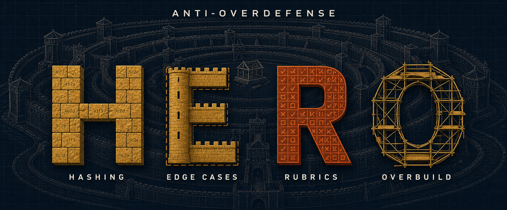

<p align="center">
  
</p>

# HERO：别让编程 Agent 把简单问题做复杂

[](LICENSE)
· [完整规则](RULES.md)
· [案例库](cases/README.md)
· [各工具放置位置](hosts/README.md)
· [详细中文说明](README_CN.md)

你让编程 Agent 写一个功能，它却先加校验和、兼容层、迁移框架、十几项检查，最后功能还没写完。

HERO 就是给 Agent 的一段范围约束。它不要求 Agent 少干活，而是要求它把时间花在当前任务上：真的问题要找，必要的测试要做，但不要为项目里根本不会发生的情况修建一整套防御工程。

## HERO 到底在防什么

HERO 是四类常见“过度防御”的首字母：

| 类型 | 通俗解释 | 常见表现 | 更合适的做法 |
|---|---|---|---|
| **H — Hashing** | 没必要也要算哈希 | 比较两个表格时，先给每一行算哈希；生成一堆没人读取的校验和文件 | 能直接比较就直接比较。只有哈希确实能省掉更昂贵的工作时才使用 |
| **E — Edge cases** | 为这里不会出现的情况操心 | 给没有用户、没有部署的演示项目设计复杂的账号防护；为理论上能构造、实际不可达的输入写大量分支 | 先问这种情况能不能通过项目支持的用法真正到达 |
| **R — Rubrics** | 不敢判断，于是制造流程 | 用评分表代替判断；补丁已经确认没问题，还反复检查；审阅器永远给“不通过” | 有真实疑点就验证，已经确定的事情不要循环复查；没问题就明确说没问题 |
| **O — Overbuild** | 为没提出的未来需求搭架子 | 提前加 feature flag、迁移框架、兼容层和层层包装 | 每一层结构都应该能对应到当前需求或真实变化 |

一句话判断：**这一步会解决当前项目里的哪个真实问题？如果答不上来，先别做。**

## 它不是“少测试、少做安全”

HERO 限制的是不成比例的解决方案，不是限制发现问题。

下面这些仍然应该做：

- 项目真实可达的边界情况，即使它听起来很少见；
- 用户、项目规范或更高优先级规则明确要求的安全、迁移、验证和审阅；
- 能回答具体疑问的测试，例如改了轮询逻辑后跑一次真实轮询；
- 共享接口或数据格式变更后的相关回归测试。

下面这些通常不值得做：

- 只因为“理论上可能”就防御项目不支持的输入；
- 对刚刚通过、之后也没改过的内容重复跑同一套检查；
- 一层保护措施的唯一理由，是保护上一层保护措施；
- 为没有发布、没有用户、没有历史版本的项目提前建设迁移体系。

拿不准时问三个问题：

1. 这种失败能通过本项目支持的用法发生吗？
2. 这次检查会发现什么具体问题？发现后，我会改变哪一步？
3. 新增的结构能直接对应到需求、真实数据或已经发生的变化吗？

## 怎么使用

把下面这段放进编程 Agent 每轮都会自动读取的配置文件。配置已经很长时用这个精简版；需要更多校准例子时使用 [`RULES.md`](RULES.md) 里的完整版。

```text
=== 精简范围约束（约束你提议什么修法，不约束你找什么）===
凡是这里真的有问题都要报，包括听起来罕见但本项目确实会产生的情况。
然后把修法收在范围内：
1. 这不是安全攻防论文。除非本项目另有说明，默认操作者是自己机器上的合作者。
   可以校验，但不要过度防御。
2. 不加哈希、校验和或指纹，除非它替代了一个明显更贵的操作，并且结果会改变下一步。
3. 不为这里不会发生的情况加 feature flag、迁移框架、兼容层或包装层。
4. 冷门编码、符号链接竞态、毫秒级竞态不在范围内，除非它能通过本项目支持的用法到达。
   能到达就要报；只是理论上能构造出来不算。
5. 该判断的地方就判断，不要换成评分表、检查清单，或对已经确定的事情再跑一遍。
6. 以上规则不覆盖用户、项目规范或更高优先级规则明确要求的安全、迁移、验证和审阅。
跑任何检查前先回答：它会发现什么具体失败？真失败了，我会改变哪一步？答不上来就别跑。
对的就说对，不要为了交差硬找问题。
```

常见工具对应的文件：

| 工具 | 放置位置 |
|---|---|
| Claude Code | 项目根目录的 `CLAUDE.md` |
| Codex / Antigravity | 项目根目录的 `AGENTS.md` |
| GitHub Copilot | `.github/copilot-instructions.md` |
| Cursor | `.cursor/rules/*.mdc`，旧项目也可能使用 `.cursorrules` |
| Windsurf | `.windsurfrules` |
| Gemini CLI | `GEMINI.md` |

只需要放入规则块，不要把整个案例库塞进 Agent 配置。案例库是给人查阅的：当 Agent 坚持某项复杂建设必不可少时，可以引用对应案例，让它解释当前情况有什么不同。

## 仓库内容

- [`RULES.md`](RULES.md)：中英文完整规则、精简规则，以及容易误判的边界；
- [`cases/README.md`](cases/README.md)：按 H、E、R、O 分类的真实行为案例和反例；
- [`hosts/README.md`](hosts/README.md)：不同编程 Agent 的配置文件位置。

这个项目没有安装包，也没有运行时依赖。把规则放进 Agent 会自动读取的文件，就完成了。

## 使用边界

HERO 是自然语言指令，不是强制执行器。它能提醒 Agent 控制范围，但更高优先级的系统规则仍然可能覆盖它，模型也不一定每次都完全遵守。

如果项目确实面向不可信用户、处理敏感数据、维护公开接口或正在迁移线上版本，请以真实威胁和项目要求为准。不要拿 HERO 当作跳过安全、兼容性或必要测试的理由。

## 来源与许可

本仓库基于 [wanshuiyin/HERO-Anti-OverDefense](https://github.com/wanshuiyin/HERO-Anti-OverDefense) 整理和改写，保留原项目的规则、案例与 MIT 许可证。原项目版权归 Ruofeng Yang 所有；本仓库的文字改写不改变原项目的许可与归属。

详见 [`LICENSE`](LICENSE)。
